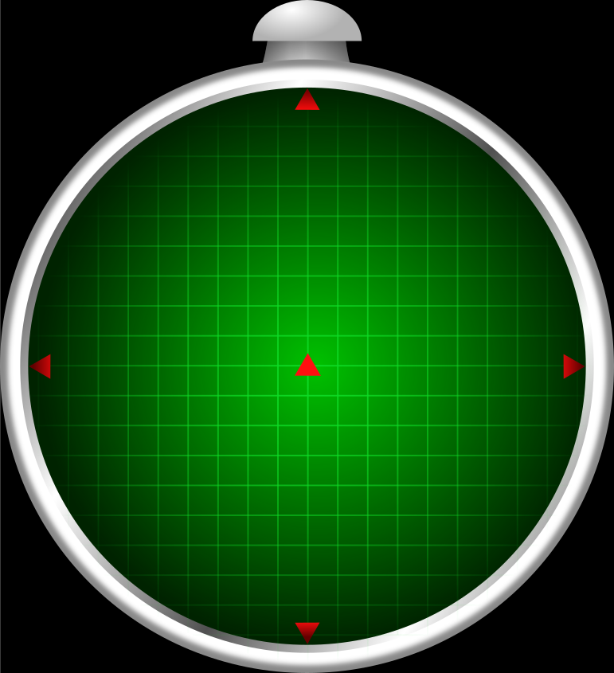
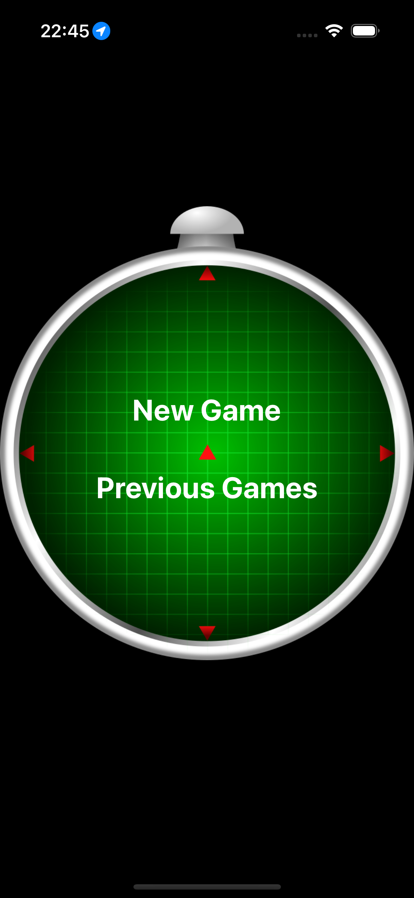
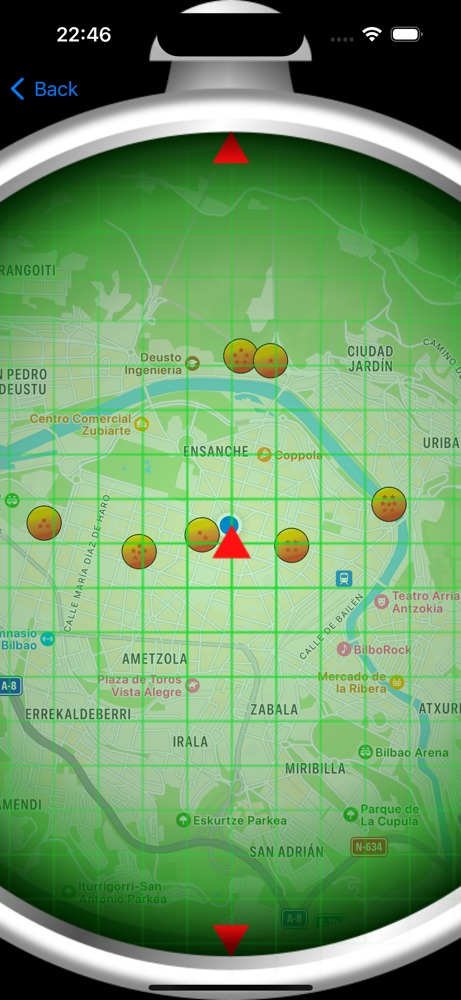
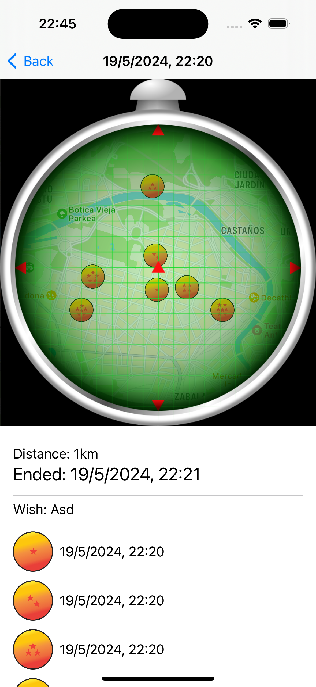

# Dragon Radar

Proyecto para aprender a hacer un [Radar del Dragón](https://dragonball.fandom.com/wiki/Dragon_Radar) de la serie Dragon Ball y retomar la programación en iOS.

Imagen del radar original obtenida de [Openclipart](https://openclipart.org/detail/260199/radar-do-dragao). Kudos to [Jonny Cantão](https://openclipart.org/artist/Jonny%20Cant%C3%A3o)

# Screenshots

## TODO

Cómo tiene que ser la aplicación:

- [x] Si hay partida empezada, continuar juego.
    - [x] Si no: pantalla de crear juego
- [x] Pantalla de crear juego
    - [x] Elegir kms de distancia
    - [x] Bucle para las 7 bolas que hace
        - [x] Randomize de coordenadas
- [x] Ver histórico de partidas?
    - [x] Pantall resumen del juego
- [ ] Pantalla del radar:
    - [x] Radar
    - [ ] Botón del radar que hace un bucle de ¿5? zooms distintos: ARRAY de zooms
    - [x] Pantalla para ver estadísticas de la partida:
        - [x] Cuándo se empezó el juego
        - [x] Ver cuál de las 7 bolas se han conseguido y cuándo
- [ ] Opción para terminar el juego
- [ ] DURANTE EL JUEGO:
    - [x] Ver mapa
    - [x] Mostrar las bolas
    - [ ] Cómo conseguir la bola?
        - [ ] Al estar cerca?
        - [x] Al hacer *longpress* en ella comprueba la distancia y si está a menos de 10 metros marcarla como cogida?
        - [x] Al coger la última bola, que aparezca un pop-up para pedir el deseo a Shenron
- [x] Dataset del juego:
    - [x] UUID
    - [x] Datetime de creación del juego
    - [x] Posición inicial del jugador al crear el juego
    - [x] Distancia elegida de juego
    - [x] ARRAY de 7 posiciones con:
        - [x] Número de bola? (O lo saco de la posición del ARRAY?)
        - [x] Geo-posición
        - [x] Cuándo se ha cogido la bola
    - [x] Datetime de cuándo se ha terminado el juego.
        - [x] Debería coincidir con la última bola conseguida?
    - [x] Deseo pedido al Dragón Shenron
